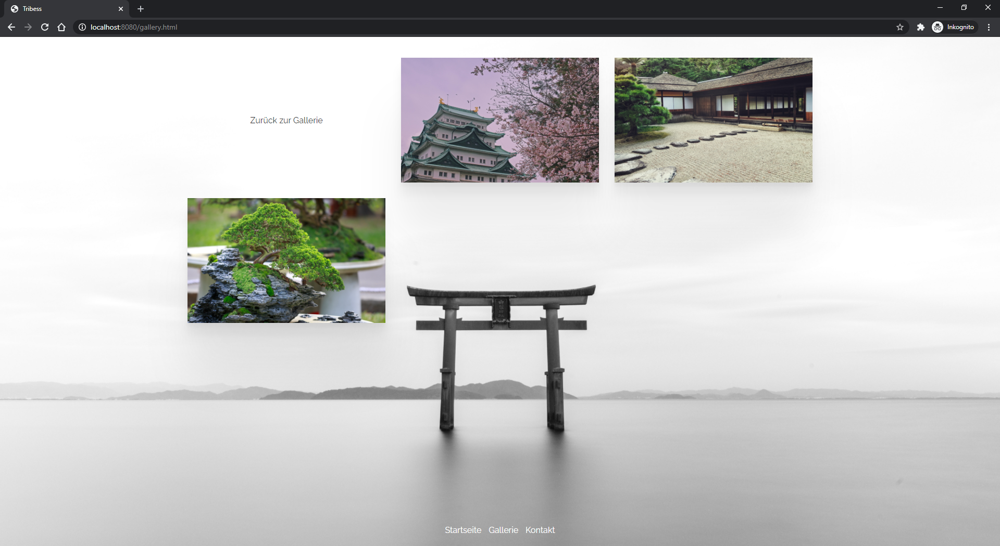

# example-html5-landingpage-buddah
[](https://github.com/Tait1337/example-html5-landingpage-buddah/actions)
[](https://sonarcloud.io/dashboard?id=Tait1337_example-html5-landingpage-buddah)
[](LICENSE)
[](http://kotlinlang.org)

Http4k based Kotlin example Web Application with multiple build options (AdoptOpenJDK, GraalVM, Project Loom).

## Getting Started

These instructions will get you a copy of the project up and running on your local machine for development and testing purposes. See deployment for notes on how to deploy the project on a live system.

### Prerequisites

Install Java JDK 17 or higher.
```
https://openjdk.java.net/install/index.html
```

Install Docker.
```
https://docs.docker.com/get-docker/
```

### Installing

Clone the Repository.
```
git clone https://github.com/tait1337/example-html5-landingpage-buddah.git
```

Run the Web Application.
```
./gradlew run
```

Navigate to http://localhost:8080.


Photos of an Album inside Gallery.



### Configuration

You can serve own Photos by creating a new directory on your disc with this structure.

```
.
+-- album
|   +-- Buddah
|   |   +-- image1.jpg
|   |   +-- image2.png
|   |   +-- thumbnails
|   |   |   +-- image1.jpg
|   |   |   +-- image2.png
|   +-- Zen_Garden
|   |   +-- image3.jpg
|   |   +-- image4.png
|   |   +-- image5.png
|   |   +-- thumbnails
|   |   |   +-- image3.jpg
|   |   |   +-- image4.png
|   |   |   +-- image5.png
```

Next you have to configure the variable `files.base.dir` inside [application.properties](src/main/resources/application.properties) with the path to the new directory.

Access to photos is restricted by Basic Authentication. You can configure the credentials inside [application.properties](src/main/resources/application.properties) too.

## Running the tests

Tests can be executed via Gradle.

```
./gradlew test
```

## Deployment

The most basic option to run the Application is by copying the `./build/libs/example-html5-landingpage-buddah-1.0.0-SNAPSHOT-all.jar` file to the target system with pre-installed Java Runtime Environment and execute it there.

```
cp ./build/libs/example-html5-landingpage-buddah-1.0.0-SNAPSHOT-all.jar /target/system/path/
java -jar /target/system/path/example-html5-landingpage-buddah-1.0.0-SNAPSHOT-all.jar
```

In addition to that you can build the Application as one of three possible Dockerimage variants.

### Built and run as Dockerimage with GraalVM native

```
docker build -t example-html5-landingpage-buddah:1.0.0-SNAPSHOT .
docker run --env-file .env -p 8080:8080 -d example-html5-landingpage-buddah:1.0.0-SNAPSHOT
```

### Built and run as Dockerimage with OpenJDK

```
docker build -t example-html5-landingpage-buddah:1.0.0-SNAPSHOT -f build-with-openjdk/Dockerfile .
docker run --env-file .env -p 8080:8080 -d example-html5-landingpage-buddah:1.0.0-SNAPSHOT
```

### Built and run as Dockerimage with Project Loom

```
docker build -t example-html5-landingpage-buddah:1.0.0-SNAPSHOT -f build-with-loom/Dockerfile .
docker run --env-file .env -p 8080:8080 -d example-html5-landingpage-buddah:1.0.0-SNAPSHOT
```

## Contributing

I encourage all the developers out there to contribute to the repository and help me to update or expand it.

To contribute just create an issue together with the pull request that contains your features or fixes.

## Versioning

We use [GitHub](https://github.com/) for versioning. For the versions available, see the [tags on this repository](https://github.com/tait1337/example-html5-landingpage-buddah/tags). 

## Authors

* **Oliver Tribess** - *Initial work* - [tait1337](https://github.com/tait1337)

## License

This project is licensed under the Apache License 2.0 - see the [LICENSE](LICENSE) file for details

## Acknowledgments

* JetBrains Team for providing [Kotlin](https://kotlinlang.org/) the statically typed fresh java-based language
* [http4k](https://www.http4k.org/) Team for providing such an amazing HTTP toolkit
* [GraalVM](https://www.graalvm.org/) Team for providing a way to build native java apps
* [Adoptium](https://adoptium.net/) Team for providing a free JDK
* [findepi](https://github.com/findepi) for providing the GraalVM builder image for docker
* [RichyHBM](https://github.com/RichyHBM) for guidance with building GraalVM native images
* Photographer of sample photos from [Pexels](https://www.pexels.com/)
